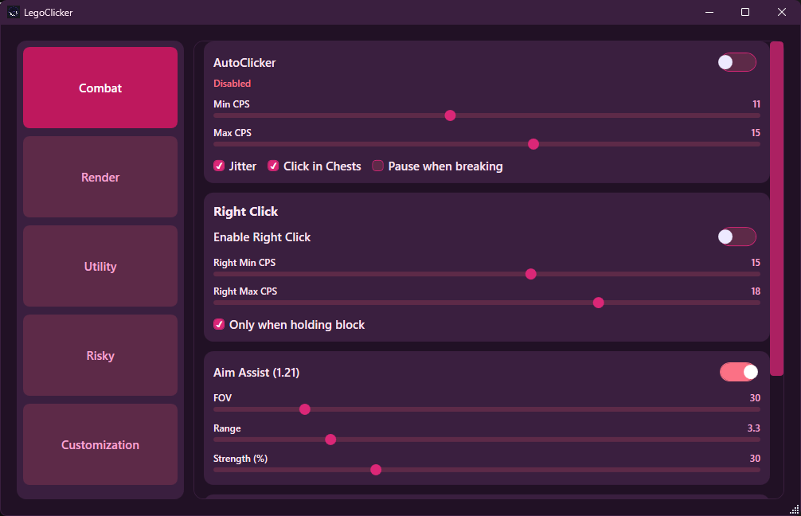

# LegoClicker

A Minecraft utility client for Lunar Client. Supports **1.8.9** and **1.21.11** with auto bridge selection in the loader.

## Screenshots

### Gameplay HUD


### Internal ClickGUI


### 1.21.11 External Control Center


## Features

- **Autoclicker** — left and right click, configurable CPS range with Gaussian jitter, block-only mode, inventory/chest safety
- **Nametags** — in-game player name tags with health bars and armor points, color-coded with chroma/accent support
- **Closest Player HUD** — compact panel showing the nearest player's name, distance, 4-way direction, health, and held item
- **Chest ESP** — highlights nearest chests through walls with render count cap and culling
- **Dual GUI modes** — **1.8.9** uses internal in-game ClickGUI (Insert), **1.21.11** uses external control center
- **Per-module keybinds** — set a key for any module directly from the in-game GUI
- **Profiles** — saved to `%AppData%\LegoClicker\profiles\` as JSON

## Requirements

- Windows 10/11 x64
- [.NET 8.0 SDK](https://dotnet.microsoft.com/download/dotnet/8.0) (build only)
- [Lunar Client](https://www.lunarclient.com/) (tested on Java Minecraft **1.8.9** and **1.21.11**)
- MinGW-w64 (for building the DLL — not needed to run)

### Lunar Client JVM flags

Add these to **Custom JVM Arguments** in Lunar Client settings:

```
-XX:+EnableDynamicAgentLoading -XX:-DisableAttachMechanism
```

## Building

### 1. C++ Bridge DLLs

```bat
cd McInjector
"C:\mingw64\mingw64\bin\g++.exe" -m64 -std=c++11 -shared -o bridge.dll src/main/cpp/bridge.cpp -I"C:/Program Files/Java/jdk-17/include" -I"C:/Program Files/Java/jdk-17/include/win32" -lws2_32 -lopengl32 -lgdi32 -static-libgcc -static-libstdc++ -Wl,--add-stdcall-alias
"C:\mingw64\mingw64\bin\g++.exe" -m64 -std=c++11 -shared -o bridge_121.dll src/main/cpp/bridge_121.cpp src/main/cpp/gl_loader.cpp src/main/cpp/imgui/imgui.cpp src/main/cpp/imgui/imgui_draw.cpp src/main/cpp/imgui/imgui_tables.cpp src/main/cpp/imgui/imgui_widgets.cpp src/main/cpp/imgui/imgui_impl_win32.cpp src/main/cpp/imgui/imgui_impl_opengl3.cpp src/main/cpp/imgui/minhook_src/buffer.c src/main/cpp/imgui/minhook_src/hook.c src/main/cpp/imgui/minhook_src/trampoline.c src/main/cpp/imgui/minhook_src/hde/hde64.c -I"C:/Program Files/Java/jdk-17/include" -I"C:/Program Files/Java/jdk-17/include/win32" -I"src/main/cpp/imgui" -I"src/main/cpp/imgui/minhook_src" -I"src/main/cpp/imgui/minhook_src/include" -lws2_32 -lopengl32 -lgdi32 -ldwmapi -static-libgcc -static-libstdc++ -Wl,--add-stdcall-alias
copy /Y bridge.dll "..\LegoClickerCS\bridge.dll"
copy /Y bridge_121.dll "..\LegoClickerCS\bridge_121.dll"
```

Requires MinGW-w64 at `C:\mingw64\mingw64\bin\g++.exe` and JDK 17 headers at `C:\Program Files\Java\jdk-17\`.
- `bridge.dll` is for the 1.8.9 path
- `bridge_121.dll` is for the 1.21.11 path

### 2. C# Loader

```bat
cd LegoClickerCS
dotnet build
dotnet publish -c Release
```

`dotnet publish -c Release` creates a **self-contained win-x64** release, so end users can run `LegoClicker.exe` without installing .NET.

## Usage

1. Launch Lunar Client with the JVM flags above
2. Run `LegoClicker.exe` from `LegoClickerCS\bin\Release\net8.0-windows\win-x64\publish\`
3. Click **Inject / Connect** in the loader window
4. For **1.8.9**, press **Insert** in-game to open internal ClickGUI
5. For **1.21.11**, use the external control center window after connect
6. Press **Backtick** (`` ` ``) to toggle the autoclicker (default bind)

## Architecture

```
LegoClickerCS (C# WPF)          McInjector (C++ DLL)
─────────────────────           ──────────────────────────────────
MainWindow        ──inject──▶  DllMain → background thread
GameStateClient   ◀──TCP 25590─  TCP server (game state ~20Hz)
InputHooks        ──TCP 25590──▶  config push + commands
Clicker (engine)                SwapBuffers hook → overlays + ClickGUI
Profile (JSON)                  JNI → reads entity/world state
```

The bridge uses **dynamic class discovery** via JVMTI and JNI reflection — no hardcoded obfuscated names — making it compatible across Lunar Client versions.

## Project layout

```
legoclickerC/
├── LegoClickerCS/          # C# WPF loader/control center (.NET 8.0)
│   ├── Core/               # Clicker, InputHooks, Profile, GameStateClient, ...
│   ├── MainWindow.xaml     # Loader window
│   ├── bridge.dll          # 1.8.9 bridge copied from McInjector
│   └── bridge_121.dll      # 1.21.11 bridge copied from McInjector
├── McInjector/
│   └── src/main/cpp/
│       ├── bridge.cpp      # 1.8.9 bridge
│       └── bridge_121.cpp  # 1.21.11 bridge
├── docs/                   # Website files
└── README.md               # This file
```

## Important rules

- The bridge is **strictly read-only** with respect to game state. It never sends packets, modifies player data, or calls any gameplay methods.
- All actions (clicks) are performed via Windows `SendInput` — external and indistinguishable from real hardware input.
