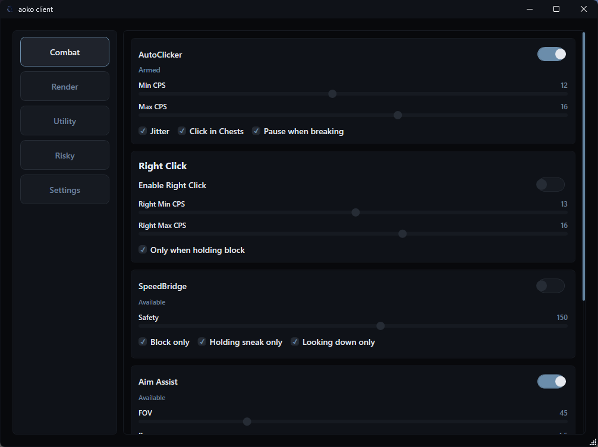
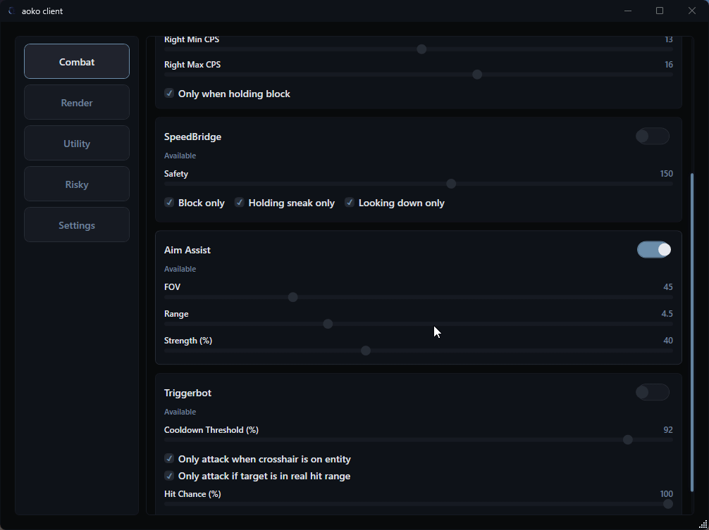
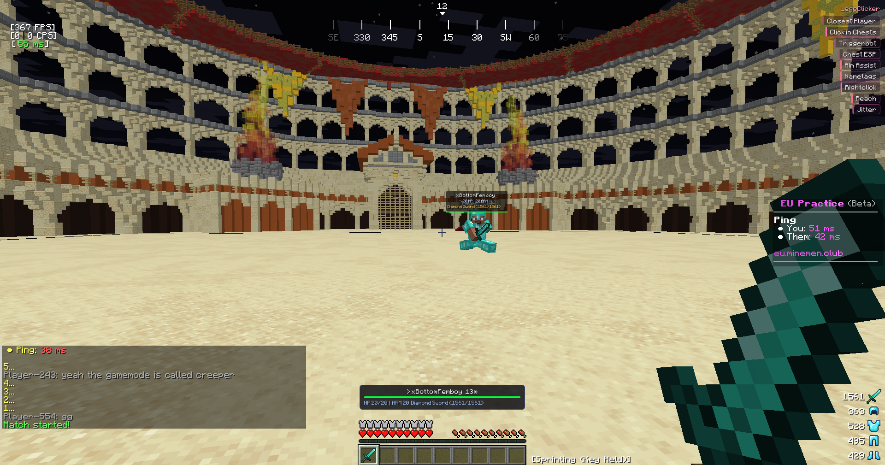
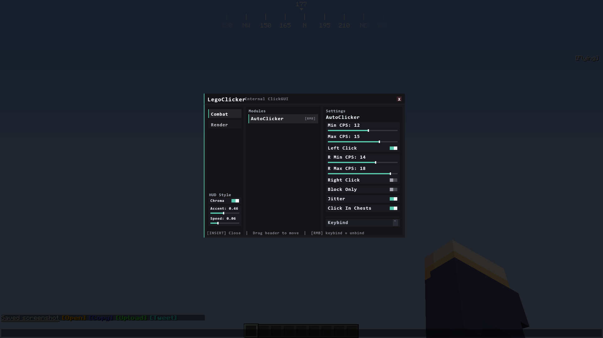

# LegoClicker

LegoClicker is a Windows utility client for Lunar Client.

## Current status

- Primary target: **1.21.11**.
- **1.8.9 is deprecated** and kept only for legacy compatibility.
- Main workflow is the external control center in `LegoClickerCS`.

## Features (current)

- Autoclicker (left/right, CPS range, jitter, block-only options)
- Aim Assist (1.21)
- Triggerbot (1.21)
- Reach and Velocity controls (1.21)
- GTB Helper (1.21)
- Nametags, Closest Player panel, Chest ESP
- Per-module keybinds
- Profiles saved in `%AppData%\LegoClicker\profiles\`
- GUI customization (palette, module list style, show logo)

## Screenshots




## Requirements

- Windows 10/11 x64
- Lunar Client
- .NET 8 SDK (build only)
- MinGW-w64 + JDK 17 headers (native build only)

### Required Lunar JVM flags

Add this to Lunar Client custom JVM arguments:

```text
-XX:+EnableDynamicAgentLoading -XX:-DisableAttachMechanism
```

## Quick start

1. Start Lunar Client.
2. Run `LegoClicker.exe`.
3. Click **Inject**.
4. Use the external control center for 1.21.11.

## Build

Run from repository root unless noted.

### Native bridge DLLs

- Build both: `build_dll.bat`
- Build 1.21 only: `McInjector\build_121.bat`
- Build 1.8.9 only (deprecated): `McInjector\build.bat`

Direct one-off compile script for 1.21:

- `build_bridge.bat`

### Loader (C#)

- Debug build: `dotnet build LegoClickerCS\LegoClickerCS.csproj`
- Release build: `dotnet build -c Release LegoClickerCS\LegoClickerCS.csproj`
- Run: `dotnet run --project LegoClickerCS\LegoClickerCS.csproj`
- Publish release exe: `build_exe.bat`

### Full release pipeline

- `build_release.bat`

## Notes on versions

- `bridge_121.dll` is the actively maintained bridge.
- `bridge.dll` (1.8.9) is legacy and not a focus for new changes.

## Project structure

```text
legoclickerC/
|- LegoClickerCS/              # WPF loader/control center (.NET 8)
|  |- Core/                    # Clicker, hooks, profile, TCP client
|  |- MainWindow.xaml(.cs)     # Main UI
|  |- bridge.dll               # 1.8.9 bridge (legacy)
|  `- bridge_121.dll           # 1.21 bridge
|- McInjector/
|  |- build.bat                # 1.8.9 bridge build (legacy)
|  |- build_121.bat            # 1.21 bridge build
|  `- src/main/cpp/            # Native bridge sources
|- docs/                       # Website
`- README.md
```

## Architecture (short)

- `LegoClickerCS` injects bridge DLL into Lunar and manages settings/UI.
- Bridge and loader communicate over TCP (`25590`).
- Bridge renders overlays and reads game state via JNI.
- Input actions are sent through Win32 `SendInput`.

## Safety constraint used by this project

- Bridge-side logic is intended to be read-only for game state.
- Do not add direct packet sending or in-game combat method calls.

## 1.8.9


