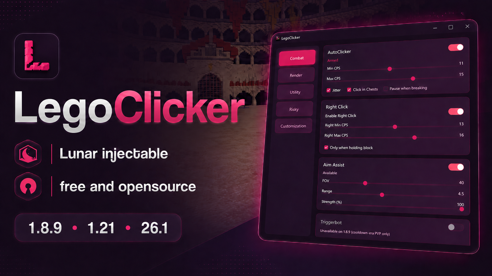
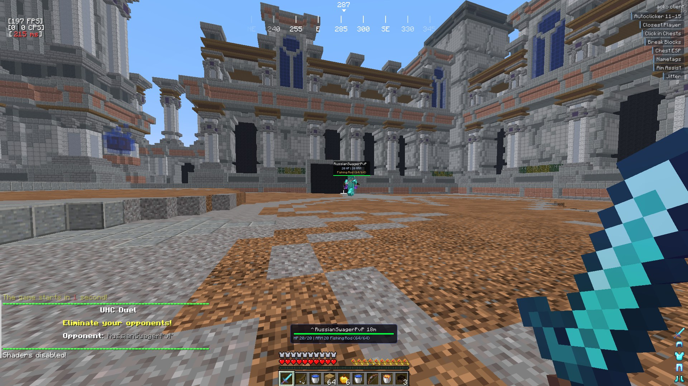

# aoko client

aoko client is a Windows utility client for Lunar Client.

# Showcase
[](https://www.youtube.com/watch?v=eR7QKAWw8D4)

## Current status

- Supported versions: **26.1**, **1.21.x**, and **1.8.9**.
- All supported versions are used through the external GUI in `Aoko/`.

## Features (current)

- Autoclicker (left/right, CPS range, jitter, block-only options)
- Aim Assist
- Triggerbot
- SpeedBridge (edge sneak assist with safety gates)
- Reach and Velocity controls
- AutoTotem (fall/explosion detection, Ghost and Anarchy modes)
- GTB Helper
- Discord Rich Presence
- Nametags, Closest Player panel, Chest ESP
- Per-module keybinds (all unbound by default)
- Profiles saved in `%AppData%\Aoko\profiles\`
- GUI customization (slate palettes, module list style, show logo)

## Look & feel

aoko client ships with a near-monochrome aesthetic across the website,
external GUI, and in-game overlay:

- One default theme (`Slate`, near-black with a coral accent) plus three
  monochrome variants (`Ink`, `Graphite`, `Steel`).
- Flat surfaces, hairline borders, no gradient backgrounds, no drop shadows.
- A single coral accent (`#C7625A`) is used very sparingly — only on the logo
  dot, sliders, the in-game module accent, and small interactive highlights.

Existing profiles are copied into `%AppData%\Aoko\profiles\` on first run when
the new profile folder is empty. The legacy profile folder is left untouched.

## Screenshots




## Requirements

- Windows 10/11 x64
- Lunar Client
- .NET 8 SDK (build only)
- MinGW-w64 + JDK 17 headers (native build only)

## Quick start

1. Start Lunar Client.
2. Run `Aoko.exe`.
3. Click **Inject**.
4. Use the external GUI (bind keys under the Keybinds tab).

1.8.9 supports menu/lobby injection. Some JNI mappings are completed lazily after a world is joined, so modules may become available once the bridge sees in-world state.

## Build

Run from repository root unless noted.

### Native bridge DLLs

- Build both: `build_dll.bat`
- Build 26.1 only: `McInjector\build_261.bat`
- Build 1.8.9 only: `McInjector\build.bat`

### Loader (C#)

- Debug build: `dotnet build Aoko\Aoko.csproj`
- Release build: `dotnet build -c Release Aoko\Aoko.csproj`
- Run: `dotnet run --project Aoko\Aoko.csproj`
- Publish release exe: `build_exe.bat`

### Full release pipeline

- `build_release.bat`

## Tests

- Run C# tests: `dotnet test Aoko.Tests\Aoko.Tests.csproj`
- Run native harness tests: `McInjector\run_tests.bat`

## Notes on versions

- `bridge_261.dll` is the modern bridge used for both 26.1 and 1.21 injection.
- `bridge.dll` (1.8.9) is supported and now builds with the shared ImGui/OpenGL backend.
- Supported runtime bridges are configured through the external GUI.
- Discord Rich Presence is configured from the external GUI under the Utility tab.

## Project structure

```text
aoko/
|- Aoko/              # WPF loader + external GUI (.NET 8)
|  |- Core/                    # Clicker, hooks, profile, TCP client
|  |- MainWindow.xaml(.cs)     # Main UI
|  |- bridge.dll               # 1.8.9 bridge (legacy)
|  `- bridge_261.dll           # 26.1 bridge
|- McInjector/
|  |- build.bat                # 1.8.9 bridge build (legacy)
|  |- build_261.bat            # 26.1 bridge build
|  `- src/main/cpp/            # Native bridge sources
|- docs/                       # Website
`- README.md
```

## Architecture (short)

- The C# loader injects the bridge DLL into Lunar and manages settings/UI.
- Bridge and loader communicate over TCP (`25590`).
- Bridge renders overlays through OpenGL/ImGui and reads game state via JNI.
- Input actions are sent through Win32 `SendInput`.
- Bridge capabilities gate version-specific modules and controls.

## Safety constraint used by this project

- Bridge-side logic is read-first. Limited ghost-safe JNI writes exist for modules such as Reach, Velocity, and nametag suppression.
- Do not add direct packet sending or in-game combat method calls.

## TODO

- Add Linux support
